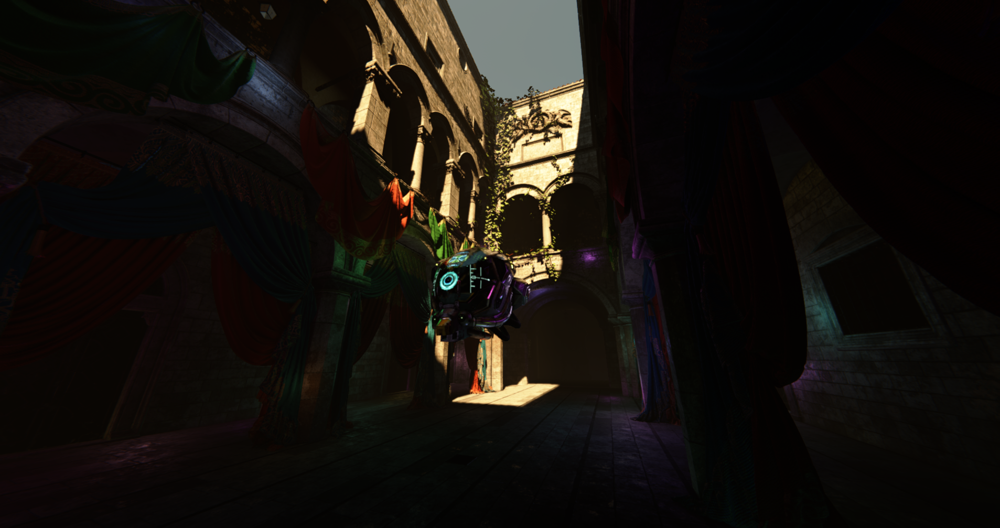
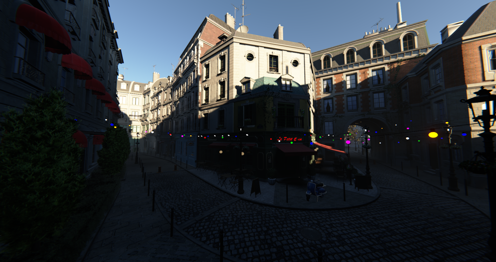
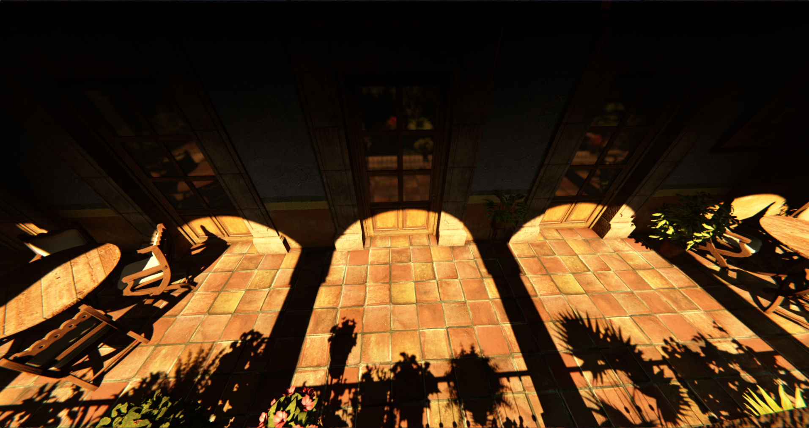

## Project Info

VK Mark-3 began in February 2025 as a single triangle rendered from a single main file. Since then, the project has grown through several code-named **"Mark"** versions, with each major version representing a significant architectural shift or expansion of the renderer.

Beyond serving as a portfolio project and long-term hobby, its primary purpose is to deepen my understanding of modern real-time rendering and engine architecture. The renderer is built around a philosophy of **fully dynamic real-time environments, GPU-driven rendering, and minimizing reliance on precomputed lighting or static scene data**. I believe that committing to these techniques is where much of the performance and scalability of modern rendering architectures can be realized, with engines such as **id Tech 8** demonstrating what is possible with this approach.

The project is under continuous research and development, and many of its rendering systems are actively evolving as I experiment with new techniques, restructure existing systems, and push the architecture further.

## Features

### Rendering Architecture

* Vulkan 1.4 GPU-driven renderer
* Mesh shader pipeline with visibility-buffer deferred rendering
* GPU address table enabling a fully bindless indirect buffer architecture
* GPU-driven instance culling and draw-command generation
* Descriptor indexing for bindless resource access
* Push descriptors for transient render targets
* Retained-mode render graph
* Async compute with multithreaded secondary command-buffer recording
* Multithreaded job system powered by EnkiTS

### Lighting & Shading

* Physically based rendering using Cook–Torrance GGX with Disney diffuse
* Physically based light units: lumens for local light output, lux for illuminance, and nits for emissive luminance
* Dynamic atmospheric sky and sun lighting inspired by techniques described for id Tech 8, replacing static environment-map lighting
* Atmospheric scattering with Rayleigh and Mie scattering, absorption, and transmittance LUTs
* Cascaded world-probe indirect lighting with ray-traced sky visibility and screen-space GI injection
* Reduced-resolution probe lighting resolve with edge-aware reconstruction for opaque surfaces
* Shared spatial lighting cache for transparent surfaces and volumetric fog
* Clustered lighting for point, spot, and area lights
* Screen-space global illumination and ambient occlusion using visibility bitmasks
* Ray-traced reflections with NRD REBLUR denoising
* Ray-traced soft sun shadows with NRD SIGMA denoising
* Cascaded shadow maps with PCF and PCSS filtering
* Screen-space contact shadows based on Bend Studio's technique
* Shadow-mapped flashlight
* Froxel-based volumetric fog with temporal reprojection, shadowed sunlight, local lights, and probe-based ambient lighting

### Geometry & Visibility

* Meshoptimizer-based mesh processing
* GPU Hi-Z depth pyramid generation
* GPU-driven visibility and occlusion culling
* Forward+ transparent rendering
* Order-independent transparency (OIT)
* Debug rendering for OBBs, wireframes, and other scene geometry

### Temporal & Post Processing

* Temporal anti-aliasing (TAA)
* Contrast Adaptive Sharpening (CAS)
* Gran Turismo-style (GT) tonemapping
* Automatic exposure with EV100-based adaptation
* Bloom
* Lens flare
* Chromatic aberration

### Assets & Tooling

* glTF 2.0 cached asset pipeline
* Block-compressed texture support
* Runtime shader compilation, shader caching, and hot reloading
* ImGui debugging and renderer controls
* Tracy CPU/GPU profiling integration

### Legacy Rendering Paths

Older anti-aliasing implementations are retained for reference, testing, and comparison. They are not part of the current rendering pipeline.

- SMAA
- CMAA2 (Intel)
- FXAA

## Future

* Runtime asset loading and management
* Dynamic mesh, material, and light interactions
* Planar reflections
* Parallax-corrected cubemaps
* Water rendering
* Spot light shadow atlas
* DLSS/FSR
* Ray-traced global illumination (RTGI)
* ReSTIR lighting
* Ray-traced transmission
* Volumetric clouds
* Temporal Upscaling
* Software based VRS
* Deferred texturing
* Virtualized geometry

## Screenshots






## Controls

* `W A S D` - Move forward, left, backward, and right
* `Space` - Move up
* `Ctrl` - Move down
* `Right Click + Mouse` - Look around
* `R` - Reset camera to spawn/origin
* `Tab` - Toggle ImGui editor
* `P` - Toggle ImGui profiling/statistics window
* `F` - Toggle flashlight
* `Esc` - Exit application

## Build Requirements

* Windows 10/11
* NVIDIA RTX 20-series+ or AMD RDNA 2+
* Vulkan SDK 1.4 or newer
* CMake 4.2 or newer
* Visual Studio 2026

## Build Steps

```bash
git clone https://github.com/Jwill724/VK_Mark-3.git
cd VK_Mark-3
cmake -S . -B build -G "Visual Studio 18 2026" -A x64
cmake --build build --config Release
```

## Assets

### Bistro and San Miguel

Bistro and San Miguel assets can be downloaded here:

https://www.dropbox.com/scl/fo/2h6jnyho16z7w0lpjah9w/AIV4BUCfhIbN1sC1hEYl8BI?rlkey=4zdox8dw65t7n5hejpvm4nepz&st=q4nrzvub&dl=0

### Intel Sponza

Intel Sponza can be downloaded from Intel's Graphics Research samples and loaded directly as glTF:

https://www.intel.com/content/www/us/en/developer/topic-technology/graphics-research/samples.html
